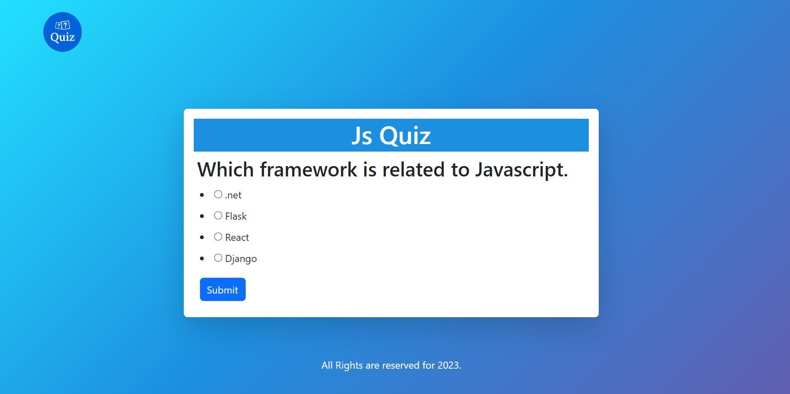

 

  

  <h3 align="center">Quiz App</h3>

  

    Challenge your mind, expand your knowledge - Quiz app, the ultimate learning experience!
     
     
    <a href="https://github.com/AmanSingh1221/ReadME-Generator"><strong>Explore the docs »</strong></a>
     
     
    <a href="https://github.com/AmanSingh1221/ReadME-Generator">View Demo</a>
    .
    <a href="https://github.com/AmanSingh1221/ReadME-Generator/issues">Report Bug</a>
    .
    <a href="https://github.com/AmanSingh1221/ReadME-Generator/issues">Request Feature</a>
  

     

## Table Of Contents

* [About the Project](#about-the-project)
* [Built With](#built-with)
* [Getting Started](#getting-started)
* [Usage](#usage)
* [Contributing](#contributing)
* [Authors](#authors)
* [Acknowledgements](#acknowledgements)

## About The Project

The Online Quiz Application is a web-based application that allows users to take quizzes . The application will provide a user-friendly interface where users can select the quiz, answer questions, and view their score at the end of the quiz.

Key Features:

Question Display: When a user starts the quiz, the application will display one question at a time.

Score Calculation: The application will calculate the user's score at the end of the quiz and display it on the screen.

Technologies Used:

The application will be built using HTML, CSS, and JavaScript, with the following technologies:

Conclusion:

The Online Quiz Application is an exciting project that will provide users with a fun and interactive way to test their knowledge on various topics. The project will require strong knowledge of HTML, CSS, and JavaScript.

## Built With

This Quiz app is built from HTML, CSS and javascript.

## Getting Started

## Usage

Here is the link: quiz-app-aman.vercel.app

## Contributing

### Creating A Pull Request

1. Fork the Project
2. Create your Feature Branch (`git checkout -b feature/AmazingFeature`)
3. Commit your Changes (`git commit -m 'Add some AmazingFeature'`)
4. Push to the Branch (`git push origin feature/AmazingFeature`)
5. Open a Pull Request

## Authors

* **Aman Singh** - *Computer Science and Engineering Student* - [Aman Singh](https://github.com/amansingh1221) - *Built Quiz app*
